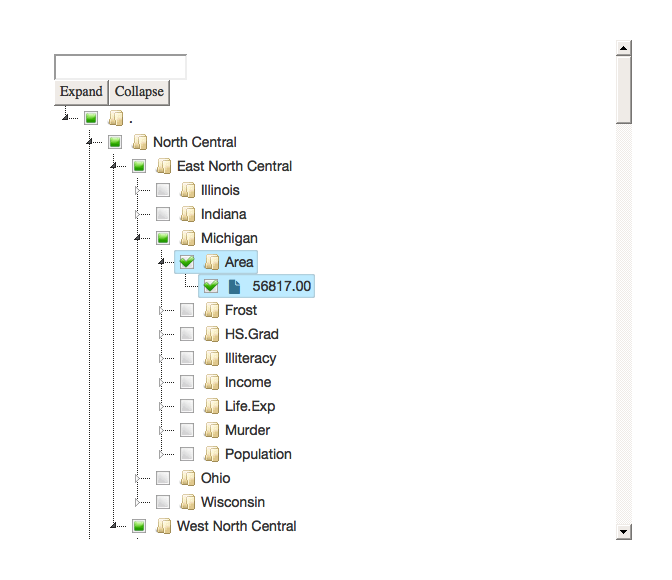
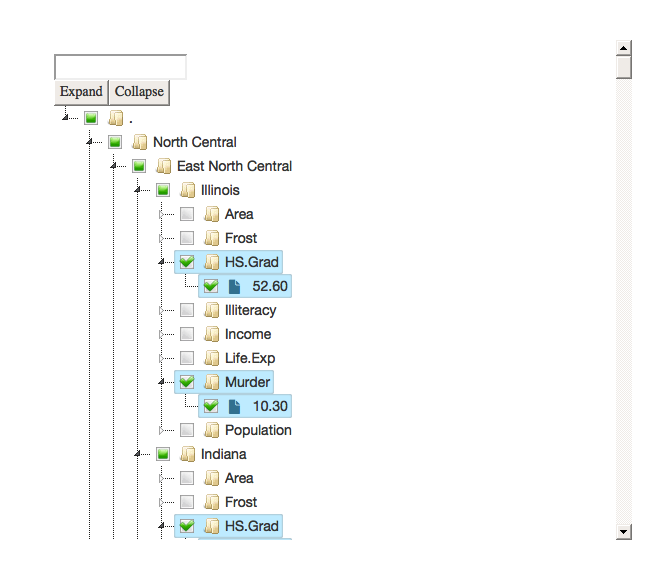
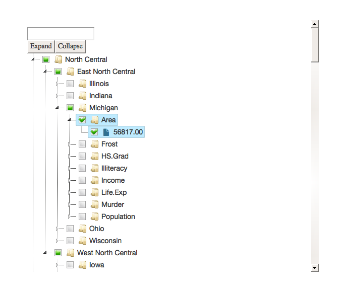

<!-- README.md is generated from README.Rmd. Please edit that file -->

[](https://cran.r-project.org/package=jsTree)
[](http://www.repostatus.org/#active)
[](https://travis-ci.org/metrumresearchgroup/jsTree)[](https://codecov.io/github/metrumresearchgroup/jsTree?branch=master)

# jsTree

`R` htmlwidget for inspecting heirachal structures with the ‘jQuery’
‘jsTree’ Plugin.

## Installation

``` r
#install.packages('jsTree')
remotes::install_github('metrumresearchgroup/jsTree')
```

## Conventional Use

``` r
library(jsTree)
data(states)
data(state_bird)
```

Initialize a new tree

``` r
x <- jsTree::jsTree$new()
```

Add data

Data can be a data.frame or a string that is collapse columns to text
(with seperator). When the data is a data.frame the seperator is
controlled by `x$sep`.

``` r
x$data  <- states
```

Initialize a new tree with data

``` r
x <- jsTree::jsTree$new(states)
```

Invoke the widget

``` r
x$show()
```

<!-- -->

Add tooltips to state names with the state bird

``` r

x$tooltips <- state_bird

x$show()
```

<!-- -->

initialize tree with checked boxes for certain fields

``` r
x$nodestate(variable=='Area')
x$show()
```

<!-- -->

``` r
x$nodestate(variable=='Area'&grepl('^M',state.name))
x$show()
```

<!-- -->

Remove node states

``` r
x$nodestate(NULL)
```

change the order of the hierarchy

``` r
#using character object as data
x$data <- apply(states[,c(4,1,2,3,5)],1,paste,collapse='/')
x$show()
```

<!-- -->

Use other delimiters to define the heirarchy

``` r
x$data <- states
x$sep <- '|-|'
x$show()
```

<!-- -->

## Interacting with remote repositories

### Preview a github repo without cloning it

``` r
remotes::install_github('metrumresearchgroup/vcs')

#get repo master branch directory structure
  vcs::navigate_remote('tidyverse/ggplot2')
```


### Search text in files of a repo without cloning it


